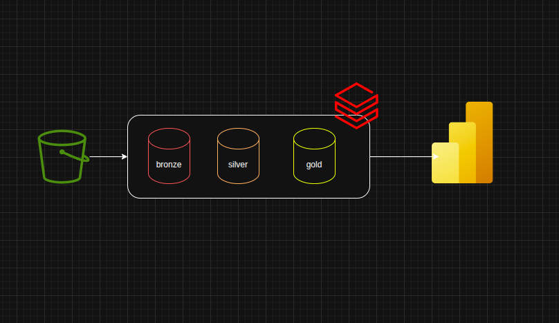
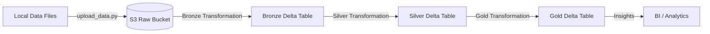

# Databricks BootCamp: AWS Data Pipeline

This project demonstrates a robust data engineering pipeline built using the **Medallion Architecture**. It leverages **Terraform** for infrastructure as code, **LocalStack** for local AWS simulation, and **Apache Spark/Databricks** for data transformations.

##  Architecture Overview

The pipeline follows the industry-standard Medallion Architecture, organizing data into three distinct layers to ensure quality and reliability:

1.  **Bronze (Raw)**: Ingests raw data from source systems without any modifications.
2.  **Silver (Cleaned)**: Cleans, filters, and standardizes data for analytical use.
3.  **Gold (Curated)**: Aggregates and transforms data into business-ready insights.



### Data Flow Diagram



##  Technology Stack

-   **Cloud Infrastructure**: AWS (S3)
-   **Local Development**: [LocalStack](https://localstack.cloud/)
-   **Infrastructure as Code**: Terraform
-   **Data Processing**: Apache Spark / Databricks
-   **Language**: Python / PySpark

##  Project Structure

```text
.
├── Infrastructure/          # Terraform configurations
│   ├── main.tf              # Provider and backend setup
│   ├── s3.tf                # S3 bucket definitions
│   └── variable.tf          # Variable declarations
├── transformations/         # Spark transformation logic
│   ├── bronze/              # Raw data ingestion to Delta
│   ├── silver/              # Data cleaning and standardization
│   └── gold/                # Business-level aggregations
├── data/                    # Local sample data for ingestion
├── img/                     # Documentation assets (Architecture diagrams)
├── upload_data.py           # Script to upload local data to S3
└── README.md                # Project documentation
```

##  Getting Started

### Prerequisites

-   [Terraform](https://www.terraform.io/downloads) installed.
-   [LocalStack](https://docs.localstack.cloud/getting-started/installation/) running locally.
-   Python 3.x with `boto3` installed.

### 1. Provision Infrastructure

Navigate to the `Infrastructure` directory and initialize Terraform:

```bash
cd Infrastructure
terraform init
terraform apply -auto-approve
```

This will create the following S3 buckets in LocalStack:
-   `aws-data-pipeline-raw-data`
-   `aws-data-pipeline-processed-data`

### 2. Ingest Data

Use the `upload_data.py` script to upload your local data files to the raw S3 bucket:

```bash
python upload_data.py --file data/transactions.csv --bucket aws-data-pipeline-raw-data --folder raw
```

### 3. Run Transformations

The transformations are located in the `transformations/` directory. These are designed to be run in a Spark environment (e.g., Databricks or a local Spark cluster):

-   **Bronze**: `transformations/bronze/bronze_transaction.py`
-   **Silver**: `transformations/silver/silver_transactions_cleaned.py`
-   **Gold**: `transformations/gold/gold_daily_transactions.py`

##  Infrastructure Details

The infrastructure is managed using Terraform and includes:
-   **Public Access Block**: S3 buckets are secured with public access blocks.
-   **Versioning**: Enabled on all buckets for data recovery and auditability.
-   **LocalStack Integration**: Configured to use local endpoints for development without incurring AWS costs.

---
*Created as part of the Databricks BootCamp.*
