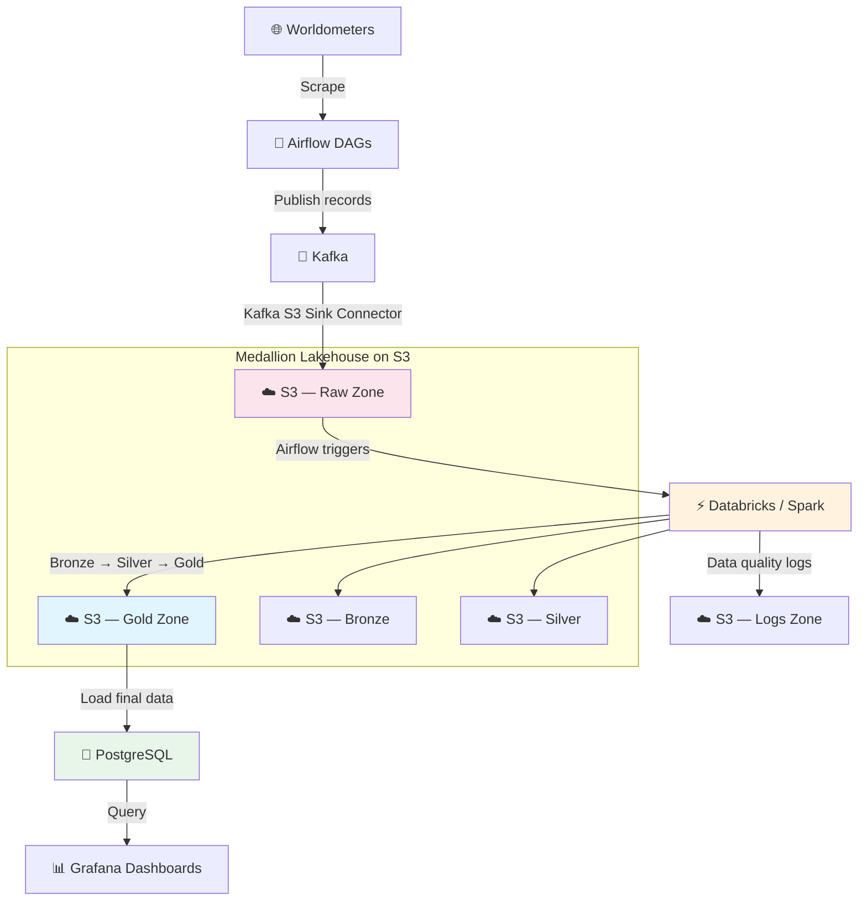

## Architecture Overview

```mermaid
graph TD
    A["🌐 Worldometers"] -->|Scrape| B["🔄 Airflow DAGs"]
    B -->|Publish records| C["📨 Kafka"]
    C -->|Kafka S3 Sink Connector| D["☁️ S3 — Raw Zone"]
    D -->|Airflow triggers| E["⚡ Databricks / Spark"]
    E -->|"Bronze → Silver → Gold"| F["☁️ S3 — Gold Zone"]
    F -->|Load final data| G["🐘 PostgreSQL"]
    G -->|Query| H["📊 Grafana Dashboards"]

    E -->|"Data quality logs"| I["☁️ S3 — Logs Zone"]

    subgraph "Medallion Lakehouse on S3"
        D
        D2["☁️ S3 — Bronze"]
        D3["☁️ S3 — Silver"]
        F
    end

    E --> D2
    E --> D3

    style E fill:#fff3e0
    style G fill:#e8f5e9
    style F fill:#e1f5fe
    style D fill:#fce4ec
```
