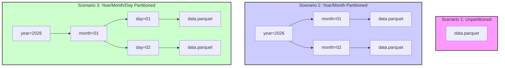

# Parquet Partitioning - Performance Optimization

This project demonstrates the power of **Data Partitioning** in Parquet files. By organizing data into a hierarchical directory structure, we can achieve massive performance gains in query speed through **Partition Pruning**.

##  Performance Visualization

The following diagram illustrates how partitioning transforms a single flat file into an optimized hierarchy:



##  Key Benefits

| Feature | Unpartitioned | Partitioned |
| :--- | :--- | :--- |
| **Query Speed** | Slow (Full Scan) | **Fast (Pruning)** |
| **I/O Overhead** | High | **Low** |
| **Scalability** | Limited | **High** |
| **Management** | Hard | **Easy (Folder-based)** |

##  How it Works

1.  **Partition Pruning**: Query engines (like Spark, Hive, or even Pandas with PyArrow) can skip entire directories if the filter condition doesn't match the partition key.
2.  **Hive-Style Naming**: We use the standard `key=value` naming convention (e.g., `year=2026/month=03`), which is automatically recognized by most Big Data tools.
3.  **Storage Efficiency**: While the total data size remains similar, the organized structure allows for much faster targeted reads.

##  Best Practices

- **Choose columns you filter by**: Partition on columns like `date`, `region`, or `category`.
- **Avoid Over-partitioning**: If your partitions are too small (e.g., only a few KB), the overhead of opening many files will slow down your queries. Aim for files > 100MB in production.
- **Consistent Hierarchy**: Always follow the same order (e.g., `year` -> `month` -> `day`).

##  Running the Demo

To see the performance difference on your own machine:

```bash
python3 partitioning.py
```

The script will:
1. Generate 3.65 million records of synthetic time-series data.
2. Write the data in three different formats.
3. Benchmark query speeds for a single date and a month range.
4. Display a detailed performance comparison.
