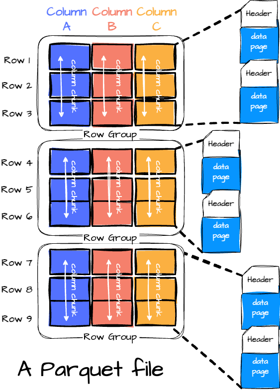
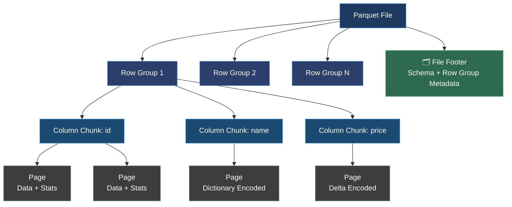
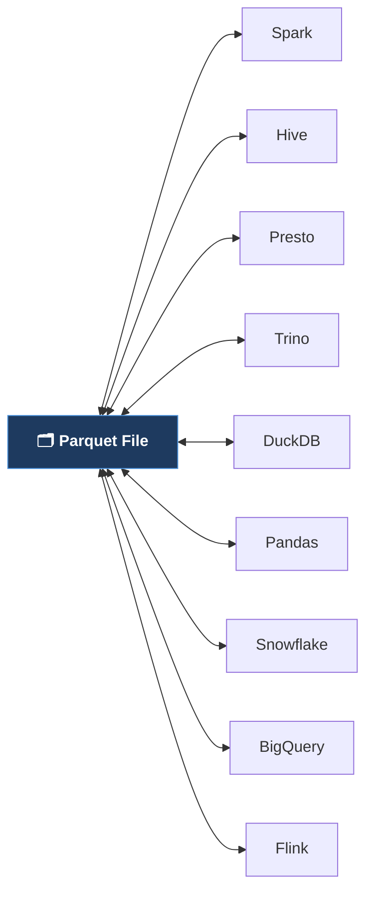

# Apache Parquet — Study Reference

> A structured overview of Apache Parquet: its origins, architecture, and role in modern data engineering.

---

## 1. What Is Apache Parquet?

Apache Parquet is an **open-source, columnar storage file format** engineered for high-performance analytical workloads. Unlike row-based formats (e.g., CSV, JSON), Parquet organizes data by column, making it highly efficient for read-heavy analytics where only a subset of fields is needed.

It was purpose-built for the **Hadoop ecosystem** and is now a foundational format in data lakes, cloud warehouses, and distributed processing pipelines.

---

## 2. History & Governance

| Attribute | Detail |
|---|---|
| **Initial Release** | 2013 |
| **Created By** | Engineers at Cloudera & Twitter |
| **Current Maintainer** | Apache Software Foundation (ASF) |
| **Specification Repo** | [apache/parquet-format](https://github.com/apache/parquet-format) |
| **Language APIs** | Java (primary), Rust |

---

## 3. Core Design Principles

### 3.1 Columnar Storage
Data is physically stored by column rather than by row. Queries that access only a few fields skip entire columns entirely, dramatically reducing I/O.

### 3.2 Schema-Based Metadata
A typed schema is embedded in the **file footer**, supporting complex nested types: `LIST`, `MAP`, and `STRUCT`. This ensures type safety and self-describing files — no external schema registry required.

### 3.3 Per-Column Compression & Encoding
Each column is encoded independently using the most effective strategy for its data profile:

- **Dictionary Encoding** — low-cardinality columns (e.g., status codes, country names)
- **Run-Length Encoding (RLE)** — repeated values (e.g., boolean flags, sorted keys)
- **Bit-Packing** — small integer ranges

Compression codecs (Snappy, Gzip, Zstd, LZ4) are then applied on top, yielding excellent compression ratios.

### 3.4 Split-Friendly Distributed Architecture
Files are organized into **Row Groups → Column Chunks → Pages**. Each row group is an independent unit that can be read in parallel by distributed engines (Spark, Presto, Trino, Dremio). Footer metadata maps byte ranges to data ranges, enabling intelligent task scheduling.

### 3.5 Schema Evolution
Parquet supports **backward and forward compatibility**. Columns can be added or removed over time without breaking existing readers or writers — critical for long-lived data pipelines.

---

## 4. File Architecture 

> **Key insight:** The file footer stores all metadata — schema, row group offsets, and column statistics. Query engines read the footer first to determine which row groups and columns to skip entirely (predicate pushdown).

---

## 5. Query Optimization Features

| Optimization | How It Works | Benefit |
|---|---|---|
| **Column Pruning** | Read only requested columns | Reduces I/O by skipping unused columns |
| **Predicate Pushdown** | Row group min/max stats checked before reading | Skips entire row groups that can't match a filter |
| **Dictionary Filtering** | Column-level dictionary checked at page level | Eliminates pages where value is absent |
| **Vectorized Reads** | Data read in column batches | CPU cache-friendly; enables SIMD optimizations |

---

## 6. Ecosystem & Interoperability

Parquet serves as the common interchange format across the modern data stack:

---

## 7. Common Use Cases

| Domain | Use Case |
|---|---|
| **Big Data Analytics / OLAP** | ETL pipelines, ad-hoc SQL queries over large datasets |
| **Data Lake Storage** | Cost-efficient storage on S3, ADLS, or GCS |
| **Machine Learning** | Feature store ingestion via Spark, Flink, or Beam |
| **Data Warehousing** | Clickstream logs, metrics, and event analytics |
| **Engine Interoperability** | Seamless data sharing across the full modern data stack |

---

## 8. Why Parquet Is the Industry Standard

-  **High Compression Ratio** — column-specific encoding + null optimization
-  **Fast Column Projection** — read only necessary columns, skip the rest
-  **Predicate Pushdown** — skip entire row groups using embedded statistics
-  **Broad Ecosystem Support** — Spark, Hive, Dremio, Snowflake, BigQuery, DuckDB, and more
-  **Schema Evolution** — safe, non-breaking schema changes over time
-  **Cloud-Native** — splits naturally across distributed filesystems and object stores

---

## 9. Further Reading

-  [Official Apache Parquet Documentation](https://parquet.apache.org/docs/)
-  [Parquet Format Specification](https://github.com/apache/parquet-format)