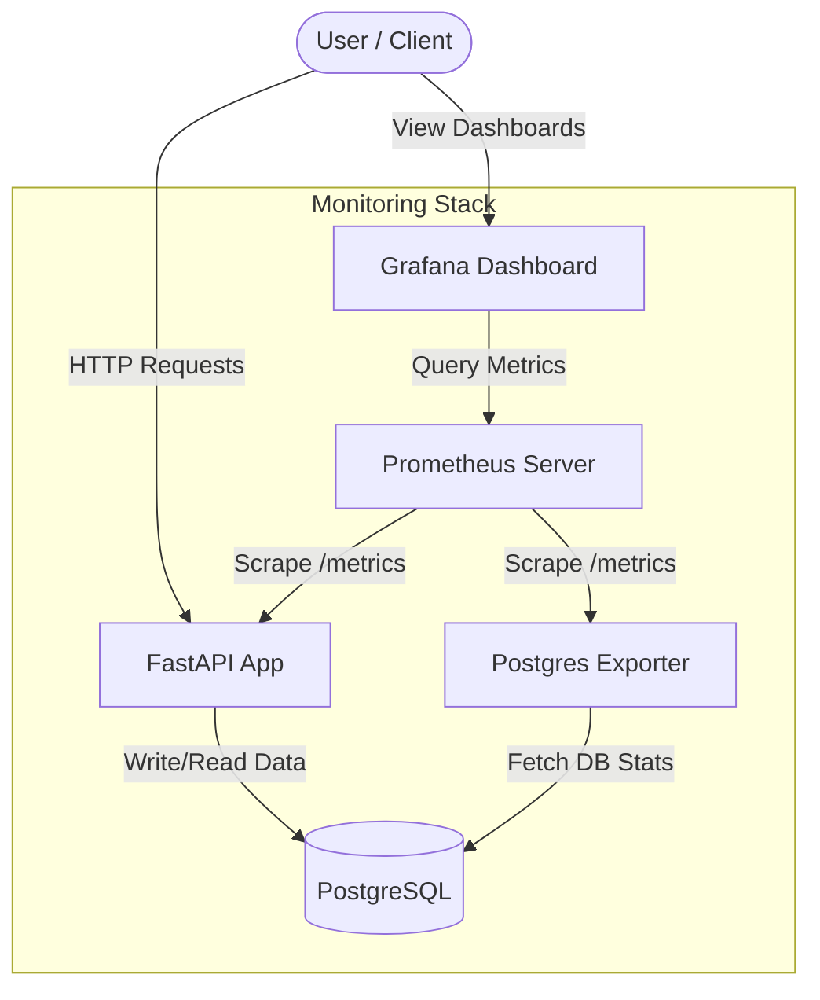
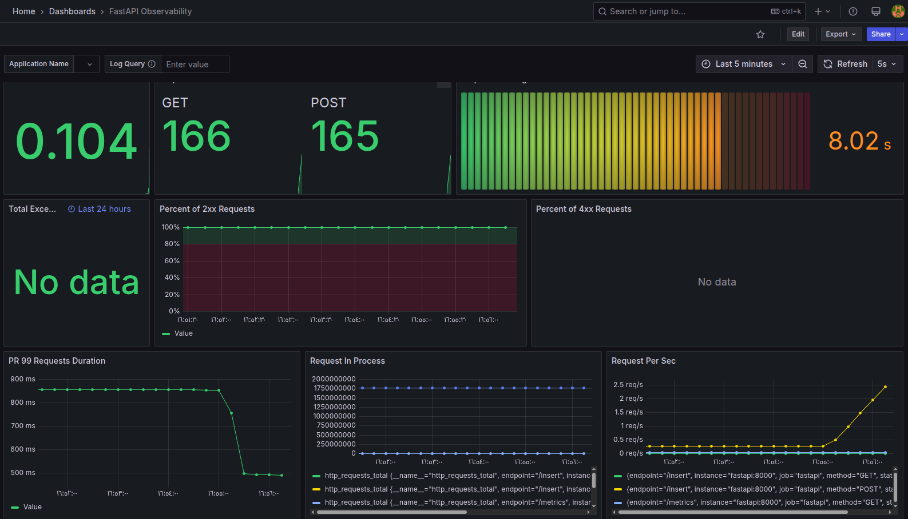
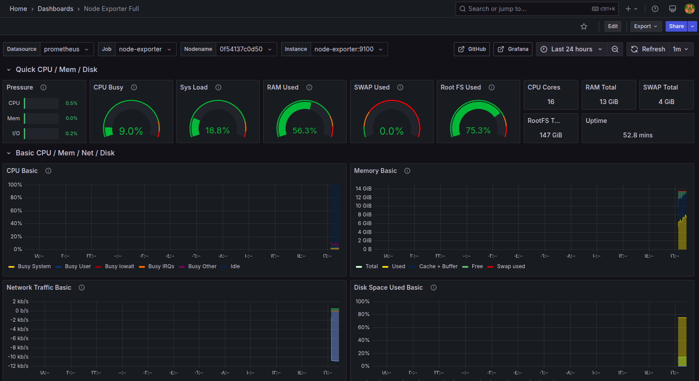

# FastAPI SQL Monitoring Stack

A production-ready FastAPI application integrated with PostgreSQL, monitored by Prometheus and Grafana.

## Architecture

This project uses a modern monitoring stack to track both application and database performance.


## Monitoring





## Quick Start
To start all services, run:
```bash
docker-compose up -d
```

## Service URLs
- **FastAPI Application**: [http://localhost:8000](http://localhost:8000)
- **FastAPI Metrics**: [http://localhost:8000/metrics](http://localhost:8000/metrics)
- **Prometheus Dashboard**: [http://localhost:9090](http://localhost:9090)
- **Grafana Dashboard**: [http://localhost:3000](http://localhost:3000) (Default login: `admin` / `admin`)
