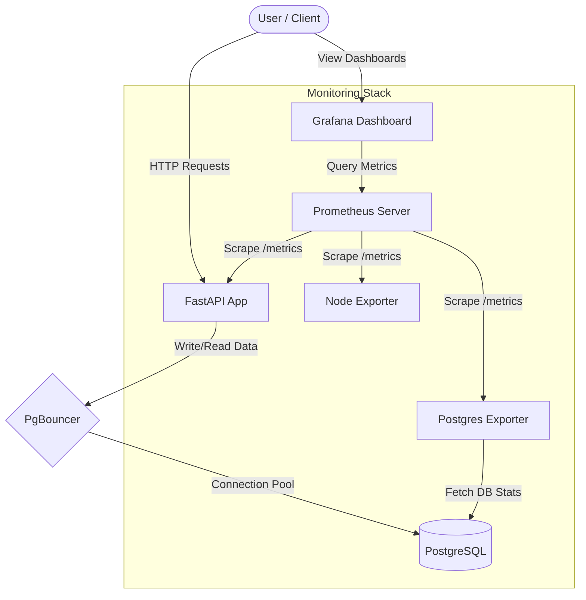

# FastAPI SQL Monitoring Stack

A production-ready FastAPI application integrated with PostgreSQL and PgBouncer, monitored by Prometheus, Grafana, Node Exporter, and PostgreSQL Exporter.

## Architecture

This project uses a modern monitoring stack to track both application, system, and database performance.



## Included Services

- **FastAPI**: The main web application serving endpoints.
- **PostgreSQL**: The relational database for application data.
- **PgBouncer**: Lightweight connection pooler for PostgreSQL.
- **Prometheus**: Time-series database for scraping and storing metrics.
- **Grafana**: Visualization platform for the monitored metrics.
- **Node Exporter**: Hardware and OS metrics exporter for the host machine.
- **Postgres Exporter**: Exporter for detailed PostgreSQL metrics.

## Quick Start

To start all services, run:
```bash
docker-compose up -d
```

## Service URLs

- **FastAPI Application**: [http://localhost:8000](http://localhost:8000)
- **FastAPI Metrics**: [http://localhost:8000/metrics](http://localhost:8000/metrics)
- **PgBouncer**: `localhost:6432`
- **Prometheus Dashboard**: [http://localhost:9090](http://localhost:9090)
- **Grafana Dashboard**: [http://localhost:3000](http://localhost:3000) (Default login: `admin` / `admin`)

## Monitoring Dashboards

### FastAPI Monitoring


### Node Exporter Monitoring

