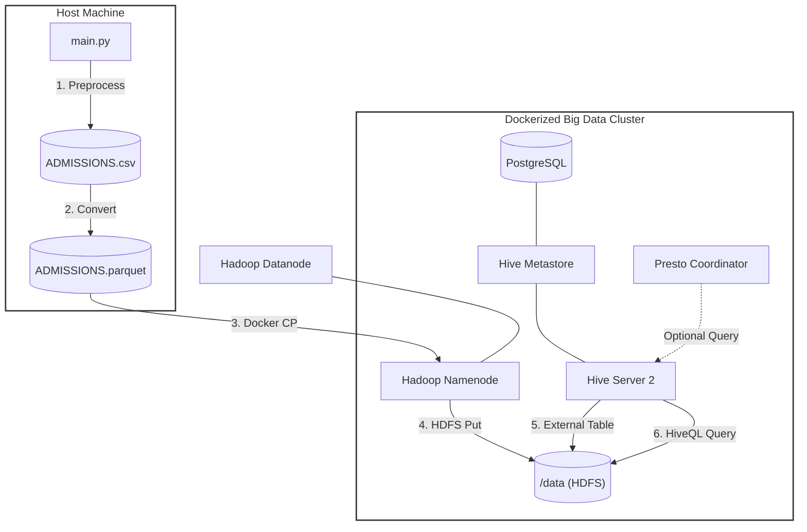

# Hadoop & Hive Data Processing Pipeline

A professional, automated data engineering pipeline for processing large datasets using Apache Hadoop, Hive, and Presto, orchestrated via Docker. This project demonstrates end-to-end data ingestion, preprocessing, and querying in a containerized Big Data environment.

##  Architecture & Data Flow

The following diagram illustrates the automated workflow from local data preprocessing to distributed querying.



##  Technology Stack

- **Orchestration**: Docker & Docker Compose
- **Storage**: Apache Hadoop (HDFS 2.7.4)
- **Data Warehouse**: Apache Hive (2.3.2)
- **SQL Engine**: PrestoDB (0.181)
- **Metadata Storage**: PostgreSQL (Metastore)
- **Automation**: Python 3 (Pandas, Numpy)

##  Getting Started

### Prerequisites

- Docker and Docker Compose
- Python 3.x
- `pandas` and `pyarrow` installed locally

### 1. Start the Infrastructure

Spin up the entire cluster using Docker Compose:

```bash
docker-compose up -d
```

### 2. Run the Automated Pipeline

The `main.py` script automates the entire lifecycle of the data processing:

```bash
python main.py
```

**What the pipeline does:**
1. **Preprocessing**: Cleans `ADMISSIONS.csv` and converts it to Parquet format.
2. **Ingestion**: Transfers data into the `namenode` container and uploads it to HDFS.
3. **Table Creation**: Dynamically creates external Hive tables pointing to the HDFS data.
4. **Validation**: Runs sample HiveQL queries to verify data integrity.

##  Manual Testing & Exploration

### Accessing Hive (Beeline)

```bash
docker-compose exec hive-server bash
/opt/hive/bin/beeline -u jdbc:hive2://localhost:10000
```

### Querying via Presto

Presto is available on port `8080`. You can use the Presto CLI to query the Hive catalog:

```bash
./presto.jar --server localhost:8080 --catalog hive --schema default
```

##  Project Structure

- `main.py`: Core automation script for the ETL pipeline.
- `docker-compose.yml`: Infrastructure definition.
- `hadoop-hive.env`: Environment configurations for the cluster.
- `data/`: Local directory for source and processed data.
- `conf/`: Custom configuration files for Hadoop and Hive.

---
*Developed as part of the Big Data Processing portfolio.*

