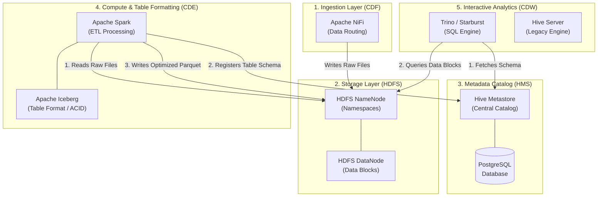

#  Cloudera CDP Data Lake Simulation

    

A professional, automated, and fully containerized Data Lake environment designed to simulate a modern enterprise **Cloudera Data Platform (CDP)** architecture. 

This environment provides a comprehensive ecosystem for testing and developing end-to-end data pipelines, featuring raw data ingestion, robust metadata management, modern open table formats (ACID transactions), and high-performance interactive querying.

---

##  Architecture & Data Flow

The architecture is explicitly layered to decouple Storage, Metadata, and Compute—the hallmark of a modern data lake.


```mermaid
flowchart TD
    %% Define Layers
    subgraph IngestionLayer ["1. Ingestion Layer (CDF)"]
        NiFi["Apache NiFi<br>(Data Routing)"]
    end

    subgraph StorageLayer ["2. Storage Layer (HDFS)"]
        direction LR
        NameNode["HDFS NameNode<br>(Namespaces)"]
        DataNode["HDFS DataNode<br>(Data Blocks)"]
        NameNode --- DataNode
    end

    subgraph MetadataLayer ["3. Metadata Catalog (HMS)"]
        HMS["Hive Metastore<br>(Central Catalog)"]
        PG[("PostgreSQL<br>Database")]
        HMS --- PG
    end

    subgraph ComputeLayer ["4. Compute & Table Formatting (CDE)"]
        Spark["Apache Spark<br>(ETL Processing)"]
        Iceberg["Apache Iceberg<br>(Table Format / ACID)"]
        Spark --- Iceberg
    end

    subgraph QueryLayer ["5. Interactive Analytics (CDW)"]
        Trino["Trino / Starburst<br>(SQL Engine)"]
        HiveServer["Hive Server<br>(Legacy Engine)"]
    end

    %% Define Flow
    NiFi -- "Writes Raw Files" --> NameNode
    
    %% Compute reads raw, writes Iceberg
    Spark -- "1. Reads Raw Files" --> NameNode
    Spark -- "2. Registers Table Schema" --> HMS
    Spark -- "3. Writes Optimized Parquet" --> NameNode

    %% Query Engine fetches and queries
    Trino -- "1. Fetches Schema" --> HMS
    Trino -- "2. Queries Data Blocks" --> NameNode
```

###  The Data Flow Explained
1. **Ingestion (`NiFi`)**: Apache NiFi pulls raw data (e.g., CSV, JSON) from external APIs or local systems and writes it directly into the **HDFS** landing zone.
2. **Compute & Formatting (`Spark` + `Iceberg`)**: Apache Spark picks up the raw data from HDFS, cleanses it, and writes it back to HDFS using the **Apache Iceberg** table format. This provides ACID guarantees (Updates/Deletes) and time-travel capabilities. Spark registers this new table's schema in the **Hive Metastore**.
3. **Interactive Analytics (`Trino`)**: When a Data Analyst runs a query, **Trino** checks the **Hive Metastore** to understand the Iceberg table structure, then directly scans the highly-optimized Parquet data blocks in **HDFS** to return results in milliseconds.

---

##  Technology Stack (CDP Mapping)

| Local Service | Enterprise Cloudera (CDP) Equivalent | Port | Purpose |
| :--- | :--- | :--- | :--- |
| **HDFS** | HDFS / SDX | `50070` | Distributed raw file storage |
| **Hive Metastore** | HMS / Data Catalog | `9083` | Centralized table schemas |
| **Apache Spark** | Cloudera Data Engineering (CDE) | `8888` (Jupyter) | Heavy ETL and processing |
| **Apache Iceberg** | Iceberg (Default Format) | - | Modern table format (ACID) |
| **Trino** | Cloudera Data Warehouse (Impala) | `8085` | Lightning-fast SQL queries |
| **Apache NiFi** | Cloudera DataFlow (CDF) | `8443` | Visual pipeline orchestration |
| **PostgreSQL** | Backing Database | `5432` | Stores the HMS metadata |

---

##  Getting Started

### 1. Spin up the cluster
Make sure Docker and Docker Compose are installed, then run:
```bash
docker-compose up -d
```
*(Wait 1-2 minutes for all services, especially the Hive Metastore, to become fully healthy).*

### 2. Run a Data Lake Workflow (Spark to Trino)

**Step A: Create an Iceberg Table using Spark**
Connect to the Spark container to simulate an ETL job:
```bash
docker exec -it spark-iceberg spark-sql
```
```sql
CREATE TABLE iceberg.default.customers (id INT, name STRING) USING iceberg;
INSERT INTO iceberg.default.customers VALUES (1, 'e& Data Team');
```

**Step B: Query the Table using Trino**
Connect to the Trino query engine to simulate an analyst running a report:
```bash
docker exec -it starburst trino --server localhost:8085
```
```sql
trino> SHOW CATALOGS;
trino> SELECT * FROM iceberg.default.customers;
```

---

##  Project Structure

```text
├── docker-compose.yml       # Infrastructure definition
├── hadoop-hive.env          # Core environment variables (HDFS/YARN/HMS)
├── source/                  # Local directory mapped to containers for raw data
└── conf/                    
    ├── spark/               # Spark-Iceberg catalog definitions
    ├── trino/               # Trino server config and Hive/Iceberg catalogs
    └── core-site.xml        # Shared HDFS routing configuration
```

---
*Built for advanced Data Engineering and Data Lake testing.*
