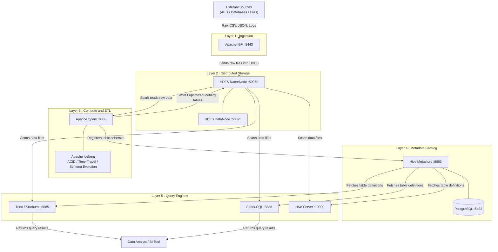

#  Cloudera CDP Data Lake Simulation

    

A professional, automated, and fully containerized Data Lake environment designed to simulate a modern enterprise **Cloudera Data Platform (CDP)** architecture. 

This environment provides a comprehensive ecosystem for testing and developing end-to-end data pipelines, featuring raw data ingestion, robust metadata management, modern open table formats (ACID transactions), and high-performance interactive querying.

---

## Architecture & Data Flow

The architecture follows an enterprise **layered decoupling** pattern — separating Ingestion, Storage, Metadata, Compute, and Query into independent tiers. Data flows **top-to-bottom** from raw sources all the way to interactive SQL analytics.


```mermaid
flowchart TB
    ExternalSources["External Sources<br>(APIs / Databases / Files)"]

    subgraph L1 ["Layer 1 : Ingestion"]
        NiFi["Apache NiFi :8443"]
    end

    subgraph L2 ["Layer 2 : Distributed Storage"]
        direction LR
        NN["HDFS NameNode :50070"]
        DN["HDFS DataNode :50075"]
        NN --- DN
    end

    subgraph L3 ["Layer 3 : Compute and ETL"]
        Spark["Apache Spark :8888"]
        IcebergFmt["Apache Iceberg<br>ACID / Time-Travel / Schema Evolution"]
        Spark --- IcebergFmt
    end

    subgraph L4 ["Layer 4 : Metadata Catalog"]
        direction LR
        HMS["Hive Metastore :9083"]
        PG[("PostgreSQL :5432")]
        HMS --- PG
    end

    subgraph L5 ["Layer 5 : Query Engines"]
        direction LR
        Trino["Trino / Starburst :8085"]
        SparkSQL["Spark SQL :8888"]
        HiveS["Hive Server :10000"]
    end

    Analyst["Data Analyst / BI Tool"]

    ExternalSources -- "Raw CSV, JSON, Logs" --> NiFi
    NiFi -- "Lands raw files into HDFS" --> NN
    NN -- "Spark reads raw data" --> Spark
    Spark -- "Writes optimized Iceberg tables" --> NN
    Spark -- "Registers table schemas" --> HMS
    HMS -- "Fetches table definitions" --> Trino
    HMS -- "Fetches table definitions" --> SparkSQL
    HMS -- "Fetches table definitions" --> HiveS
    NN -- "Scans data files" --> Trino
    NN -- "Scans data files" --> SparkSQL
    NN -- "Scans data files" --> HiveS
    Trino -- "Returns query results" --> Analyst
    SparkSQL -- "Returns query results" --> Analyst
```

### The Data Flow — Step by Step

| Step | Layer | What Happens |
| :---: | :--- | :--- |
| **1** | **Ingestion** | Raw data (CSV, JSON, telecom logs) arrives from external sources. **Apache NiFi** visually routes and lands these files into the HDFS landing zone — no code required. |
| **2** | **Storage** | **HDFS** stores the raw files in a distributed, fault-tolerant manner. The **NameNode** tracks file locations while the **DataNode** holds the actual data blocks. |
| **3** | **Compute** | **Apache Spark** reads the raw files from HDFS, cleanses and transforms them, then writes the output back to HDFS using the **Apache Iceberg** table format. Iceberg adds enterprise capabilities: ACID transactions (UPDATE/DELETE), time-travel queries, and safe schema evolution. |
| **4** | **Metadata** | Spark registers the new Iceberg table schema in the **Hive Metastore (HMS)**. The HMS acts as the central catalog — it knows every table's column names, data types, and physical HDFS location. PostgreSQL persistently stores this metadata. |
| **5** | **Query Engine** | Data Analysts can query the data using **three engines**: **Trino** for millisecond interactive analytics, **Spark SQL** for complex analytical queries on both Hive and Iceberg tables, or **Hive Server** for legacy HiveQL compatibility. All three engines read schemas from HMS and scan data from HDFS. |

---

##  Technology Stack (CDP Mapping)

| Local Service | Enterprise Cloudera (CDP) Equivalent | Port | Purpose |
| :--- | :--- | :--- | :--- |
| **HDFS** | HDFS / SDX | `50070` | Distributed raw file storage |
| **Hive Metastore** | HMS / Data Catalog | `9083` | Centralized table schemas |
| **Apache Spark** | Cloudera Data Engineering (CDE) | `8888` (Jupyter) | Heavy ETL and processing |
| **Apache Iceberg** | Iceberg (Default Format) | - | Modern table format (ACID) |
| **Trino** | Cloudera Data Warehouse (Impala) | `8085` | Lightning-fast SQL queries |
| **Apache NiFi** | Cloudera DataFlow (CDF) | `8443` | Visual pipeline orchestration |
| **PostgreSQL** | Backing Database | `5432` | Stores the HMS metadata |

---

##  Getting Started

### 1. Spin up the cluster
Make sure Docker and Docker Compose are installed, then run:
```bash
docker-compose up -d
```
*(Wait 1-2 minutes for all services, especially the Hive Metastore, to become fully healthy).*

### 2. Run a Data Lake Workflow (Spark to Trino)

**Step A: Create an Iceberg Table using Spark**
Connect to the Spark container to simulate an ETL job:
```bash
docker exec -it spark-iceberg spark-sql
```
```sql
CREATE TABLE iceberg.default.customers (id INT, name STRING) USING iceberg;
INSERT INTO iceberg.default.customers VALUES (1, 'e& Data Team');
```

**Step B: Query the Table using Trino**
Connect to the Trino query engine to simulate an analyst running a report:
```bash
docker exec -it starburst trino --server localhost:8085
```
```sql
trino> SHOW CATALOGS;
trino> SELECT * FROM iceberg.default.customers;
```

---

##  Project Structure

```text
├── docker-compose.yml       # Infrastructure definition
├── hadoop-hive.env          # Core environment variables (HDFS/YARN/HMS)
├── source/                  # Local directory mapped to containers for raw data
└── conf/                    
    ├── spark/               # Spark-Iceberg catalog definitions
    ├── trino/               # Trino server config and Hive/Iceberg catalogs
    └── core-site.xml        # Shared HDFS routing configuration
```

---
*Built for advanced Data Engineering and Data Lake testing.*
