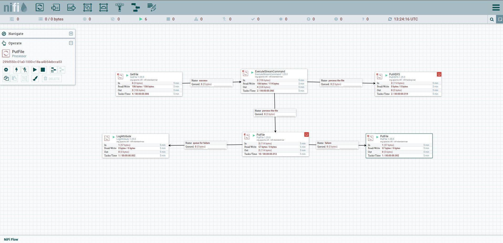
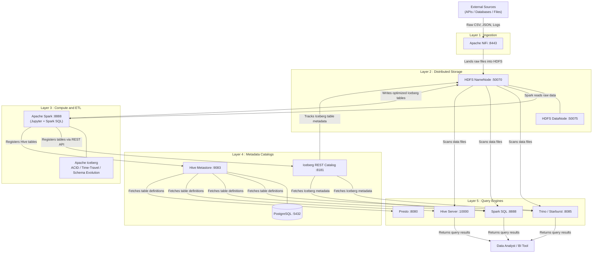

#  Cloudera CDP Data Lake Simulation

     

A professional, automated, and fully containerized Data Lake environment designed to simulate a modern enterprise **Cloudera Data Platform (CDP)** architecture. 

This environment provides a comprehensive ecosystem for testing and developing end-to-end data pipelines, featuring raw data ingestion, robust metadata management, modern open table formats (ACID transactions), and high-performance interactive querying.

---

## Architecture & Data Flow


The architecture follows an enterprise **layered decoupling** pattern — separating Ingestion, Storage, Metadata, Compute, and Query into independent tiers. Data flows **top-to-bottom** from raw sources all the way to interactive SQL analytics.


```mermaid
flowchart TB
    ExternalSources["External Sources<br>(APIs / Databases / Files)"]

    subgraph L1 ["Layer 1 : Ingestion"]
        NiFi["Apache NiFi :8443"]
    end

    subgraph L2 ["Layer 2 : Distributed Storage"]
        direction LR
        NN["HDFS NameNode :50070"]
        DN["HDFS DataNode :50075"]
        NN --- DN
    end

    subgraph L3 ["Layer 3 : Compute and ETL"]
        Spark["Apache Spark :8888<br>(Jupyter + Spark SQL)"]
        IcebergFmt["Apache Iceberg<br>ACID / Time-Travel / Schema Evolution"]
        Spark --- IcebergFmt
    end

    subgraph L4 ["Layer 4 : Metadata Catalogs"]
        direction LR
        HMS["Hive Metastore :9083"]
        PG[("PostgreSQL :5432")]
        IcebergRest["Iceberg REST Catalog :8181"]
        HMS --- PG
    end

    subgraph L5 ["Layer 5 : Query Engines"]
        direction LR
        Trino["Trino / Starburst :8085"]
        SparkSQL["Spark SQL :8888"]
        HiveS["Hive Server :10000"]
        Presto["Presto :8080"]
    end

    Analyst["Data Analyst / BI Tool"]

    ExternalSources -- "Raw CSV, JSON, Logs" --> NiFi
    NiFi -- "Lands raw files into HDFS" --> NN
    NN -- "Spark reads raw data" --> Spark
    Spark -- "Writes optimized Iceberg tables" --> NN
    Spark -- "Registers tables via REST API" --> IcebergRest
    Spark -- "Registers Hive tables" --> HMS
    IcebergRest -- "Tracks Iceberg table metadata" --> NN
    HMS -- "Fetches table definitions" --> Trino
    HMS -- "Fetches table definitions" --> SparkSQL
    HMS -- "Fetches table definitions" --> HiveS
    HMS -- "Fetches table definitions" --> Presto
    IcebergRest -- "Fetches Iceberg metadata" --> Trino
    IcebergRest -- "Fetches Iceberg metadata" --> SparkSQL
    NN -- "Scans data files" --> Trino
    NN -- "Scans data files" --> SparkSQL
    NN -- "Scans data files" --> HiveS
    Trino -- "Returns query results" --> Analyst
    SparkSQL -- "Returns query results" --> Analyst
    HiveS -- "Returns query results" --> Analyst
```

### The Data Flow — Step by Step

| Step | Layer | What Happens |
| :---: | :--- | :--- |
| **1** | **Ingestion** | Raw data (CSV, JSON, logs) arrives from external sources. **Apache NiFi** visually routes and lands these files into the HDFS landing zone (e.g., `/Anas/`) — no code required. NiFi uses `GetFile` to read from the local `./source` folder and `PutHDFS` to write into HDFS. |
| **2** | **Storage** | **HDFS** stores the raw files in a distributed, fault-tolerant manner. The **NameNode** tracks file locations while the **DataNode** holds the actual data blocks. Each dataset should have its own dedicated subfolder (e.g., `/Anas/Users/tmp_data/`). |
| **3** | **Compute** | **Apache Spark** reads the raw files from HDFS, cleanses and transforms them, then writes the output back to HDFS using the **Apache Iceberg** table format. Iceberg adds enterprise capabilities: ACID transactions (UPDATE/DELETE), time-travel queries, and safe schema evolution. |
| **4** | **Metadata** | Spark registers new tables via two catalog paths: **(a)** The **Hive Metastore (HMS)** for traditional Hive tables and Hive-backed Iceberg tables. **(b)** The **Iceberg REST Catalog** for REST-managed Iceberg tables. Both catalogs track table schemas, column types, and physical HDFS locations. PostgreSQL persistently stores the HMS metadata. |
| **5** | **Query Engines** | Data Analysts can query the data using **four engines**: **Trino/Starburst** for millisecond interactive analytics (supports both `hive` and `iceberg_rest` catalogs), **Spark SQL** for complex analytical queries, **Hive Server** for legacy HiveQL compatibility, or **Presto** for additional SQL access. |

---

## Two Types of Catalogs

This architecture supports two catalog types, both available to Spark and Trino:

| Catalog | Type | Service | Purpose |
| :--- | :--- | :--- | :--- |
| **`hive`** | Hive Metastore | `hive-metastore:9083` | Traditional Hive external tables and Hive-backed Iceberg tables. Tables are registered via the Thrift protocol. |
| **`iceberg_rest`** | REST Catalog | `iceberg-rest:8181` | REST-managed Iceberg tables. Provides a standard HTTP API for table management. Preferred for pure Iceberg workflows. |

### How to use each catalog

**In Spark SQL:**
```sql
-- Hive catalog
SELECT * FROM iceberg.default.my_table;

-- REST catalog
SELECT * FROM iceberg_rest.demo.my_table;
```

**In Trino:**
```sql
-- Hive catalog (raw Hive tables)
SELECT * FROM hive.default.my_table;

-- Iceberg REST catalog
SELECT * FROM iceberg_rest.demo.my_table;
```

---

##  Technology Stack (CDP Mapping)

| Local Service | Enterprise Cloudera (CDP) Equivalent | Port | Purpose |
| :--- | :--- | :--- | :--- |
| **HDFS** | HDFS / SDX | `50070`, `50075` | Distributed raw file storage |
| **Hive Metastore** | HMS / Data Catalog | `9083` | Centralized table schemas (Thrift) |
| **Iceberg REST Catalog** | Iceberg REST Catalog | `8181` | REST-based Iceberg table management |
| **Apache Spark** | Cloudera Data Engineering (CDE) | `8888` (Jupyter), `8081` (UI) | Heavy ETL and processing |
| **Apache Iceberg** | Iceberg (Default Format) | - | Modern table format (ACID) |
| **Trino / Starburst** | Cloudera Data Warehouse (Impala) | `8085` | Lightning-fast interactive SQL queries |
| **Apache NiFi** | Cloudera DataFlow (CDF) | `8443` | Visual pipeline orchestration |
| **Presto** | PrestoDB | `8080` | Additional SQL query engine |
| **Hive Server** | HiveServer2 | `10000` | Legacy HiveQL query interface |
| **PostgreSQL** | Backing Database | `5432` | Stores the HMS metadata |

---

##  Getting Started

### 1. Spin up the cluster
Make sure Docker and Docker Compose are installed, then run:
```bash
docker-compose up -d
```
*(Wait 1-2 minutes for all services, especially the Hive Metastore, to become fully healthy).*

### 2. Access the Web UIs

| Service | URL |
| :--- | :--- |
| **NiFi** | [http://localhost:8443/nifi](http://localhost:8443/nifi) |
| **HDFS NameNode** | [http://localhost:50070](http://localhost:50070) |
| **Spark (Jupyter)** | [http://localhost:8888](http://localhost:8888) |
| **Spark Master UI** | [http://localhost:8081](http://localhost:8081) |
| **Trino / Starburst** | [http://localhost:8085](http://localhost:8085) |

### 3. End-to-End Pipeline Example

**Step A: Ingest raw data using NiFi**
Place CSV files in the `./source/` folder. NiFi automatically picks them up via `GetFile` and writes them to HDFS (`/Anas/`) via `PutHDFS`.

**Step B: Create an Iceberg Table using Spark**
Connect to the Spark container:
```bash
docker exec -it spark-iceberg spark-sql
```
```sql
-- Read the raw CSV from HDFS and create an Iceberg table
CREATE TEMPORARY VIEW temp_csv USING csv
OPTIONS (path 'hdfs://namenode:8020/Anas/Users/tmp_data/tmp.csv', header 'true', inferSchema 'true');

CREATE NAMESPACE IF NOT EXISTS iceberg_rest.demo;
CREATE TABLE iceberg_rest.demo.users USING iceberg AS SELECT * FROM temp_csv;
```

**Step C: Query the Iceberg table using Trino**
```bash
docker exec -it starburst trino --server http://localhost:8085
```
```sql
SELECT * FROM iceberg_rest.demo.users;
```

**Step D: Query the raw data directly using Hive**
```bash
docker exec -it hive-server /opt/hive/bin/hive
```
```sql
CREATE EXTERNAL TABLE IF NOT EXISTS users (id INT, name STRING, sal INT)
ROW FORMAT DELIMITED FIELDS TERMINATED BY ','
STORED AS TEXTFILE
LOCATION 'hdfs:///Anas/Users/tmp_data'
TBLPROPERTIES ('skip.header.line.count'='1');

SELECT * FROM users;
```

---

##  Project Structure

```text
├── docker-compose.yml       # Infrastructure definition (all services)
├── hadoop-hive.env          # Core environment variables (HDFS/YARN/HMS)
├── source/                  # Local directory mounted into NiFi for raw data ingestion
└── conf/                    
    ├── core-site.xml        # Shared HDFS routing configuration (fs.defaultFS)
    ├── spark/               
    │   ├── spark-defaults.conf  # Spark catalog definitions (hive, iceberg, iceberg_rest)
    │   └── hive-site.xml        # Spark-Hive integration config
    └── trino/               
        ├── config.properties    # Trino server settings (port 8085)
        ├── jvm.config           # JVM memory settings
        ├── node.properties      # Node identity
        ├── log.properties       # Logging configuration
        └── catalog/
            ├── hive.properties          # Trino → Hive Metastore catalog
            ├── iceberg.properties       # Trino → Hive-backed Iceberg catalog
            └── iceberg_rest.properties  # Trino → Iceberg REST catalog
```

---
*Built for advanced Data Engineering and Data Lake testing.*
