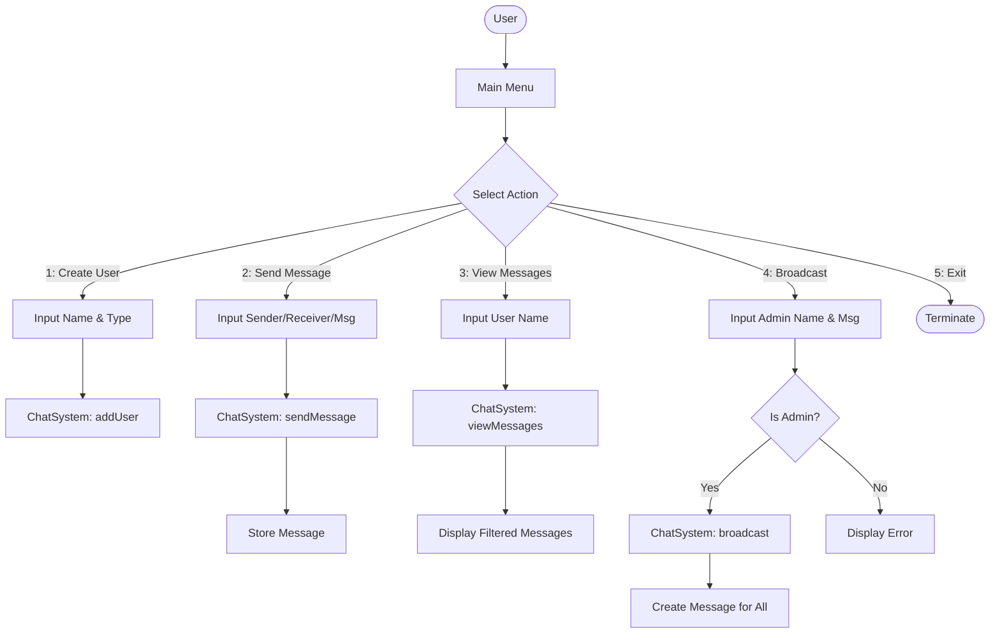

# Console Chat System

A simple Java-based console application for managing users and facilitating messaging. This project demonstrates a basic architecture for a chat system, including user roles (Regular and Admin) and broadcast capabilities.

##  Features

- **User Management**: Create regular users or administrators.
- **Direct Messaging**: Send private messages between users.
- **Message History**: View all messages received by a specific user.
- **Admin Broadcast**: Admins can send a message to all users in the system.
- **Interactive CLI**: Easy-to-use command-line interface for all operations.

##  Project Structure

```text
.
├── Main.java              # Entry point and CLI logic
├── models/
│   ├── User.java          # Base User class
│   ├── Admin.java         # Admin class (extends User)
│   └── Message.java       # Message data model
└── system/
    └── ChatSystem.java    # Core system logic and data storage
```

##  System Flow

The following diagram illustrates the flow of operations within the system:



##  Setup and Running

### Prerequisites

- Java Development Kit (JDK) 8 or higher.

### Compilation

Compile all Java files from the root directory:

```bash
javac -d out Main.java models/*.java system/*.java
```

### Execution

Run the application:

```bash
java -cp out Main
```

##  License

This project is open-source and available under the MIT License.
